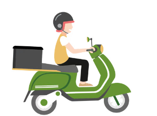

# Web程式設計 HW1 負評救星-當機等候網頁

# 目標網站— UberEats

**目標網址**：[https://www.ubereats.com/](https://www.ubereats.com/)


說明：UberEats為一個國際性的外送平台，擁有許多美食，每日透過使用UberEats來吃三餐的人

在臺灣不佔少數，極有可能會因為人流過大而導致當機，因此選定該主題。

# 設計理念
- 網頁上的用色基本上採用UberEats的綠白黑所組成
- 利用自動跳轉功能，能讓使用者不必重複刷新該網頁

# 全部程式碼

## HTML

```html

<!DOCTYPE html> <!-- 告訴瀏覽器使用的 HTML 版本 -->
<html lang="en"> <!-- 設定語言為英文 -->
<head> <!-- 網頁的標頭 -->
    <meta charset="UTF-8"> <!-- 設定文件編碼為 UTF-8 -->
    <meta name="viewport" content="width=device-width, initial-scale=1.0">
    <title>當機網頁</title> <!-- 設定網頁標題 -->
    <link rel="stylesheet" href="style.css"> <!-- 引用 CSS 樣式表 -->
</head>
<body> <!-- 網頁的主要內容 -->
<div class="column">
   
</div>
<div class="container">
    <div class="word">
        <h1>Oops! 發生了一點問題!</h1>
            <p>您的網頁已經在路上了 請稍候</p>
              <p>網頁抵達時將會自動跳轉</p>
    </div>

    <div class="progress-bar">
        
        <div class="progress"></div>

    </div>
    <div class="waiting-count"></div>
</div>
<script src="main.js"></script>
</body>
</html> <!-- HTML 文件結束標籤 -->
```

## CSS

```css
@media (max-width: 768px) {
    .column {
        padding: 5px;
    }
    .word {
        font-size: 20px;
    }
    .top {
        font-size: 30px;
    }
    .waiting-count {
        margin-top: 100px;
        font-size: 30px;
    }
}
html {
    font-family: 'Helvetica Neue', Helvetica, Arial, sans-serif;
    height: 100%;
}
.column {
    background-color: #14d314;
    padding: 10px;
}

.progress-bar {
    position: relative;
    background-color: #ddd;
    height: 20px;
    width: 67%;
    border-radius: 10px;
    top: 55%;
}

.progress {
    background-color: green;
    height: 100%;
    border-radius: 10px;
    transition: width 1s ease;
}

.container {
    display: flex;
    flex-direction: column;
    justify-content: center;
    align-items: center;
    height: 100vh;
    position: relative;
    overflow: hidden;
}

.word {
    position: absolute;
    top: 20%;
    left: 50%;
    transform: translate(-50%, -50%);
    color: black;
    font-size: 30px;
    font-weight: bold;
    line-height: 45px;
    margin-bottom: 50px;
    text-align: center;
}

h1 {
    font-size: 50px;
}

.img {
    position: absolute;
    left: calc(67% - 10%);
    top: 0; /* 調整圖片位置，讓圖片與進度條上緣對齊 */
    z-index: 2;
    width: 20%;
    height: auto;
}

.waiting-count {
    font-size: 40px;
    text-align: center;
    margin-top: 400px;
}
body {
    min-width: 320px;
    min-height: 480px;
}
```

## JavaScript

```jsx
const progressBar = document.querySelector('.progress');
const img = document.querySelector('.img');
const waitCountElem = document.querySelector('.waiting-count');
let progress = 0;
const totalWaitCount = Math.floor(Math.random()*1000);
function updateProgress(){
    img.style.minWidth = '50px';
    img.style.minHeight = '50px';
    progressBar.style.minHeight = '10px';
    progress += 1;
    img.style.left = progressBar.offsetWidth - img.offsetWidth/2+ 'px';
    progressBar.style.width = progress+'%';
    const remainingWaitCount = Math.floor(totalWaitCount * progress / 100);
    waitCountElem.innerText = `目前還有 ${totalWaitCount-remainingWaitCount} 個人正在等待進入\n\n請勿跳轉頁面`;
    if (progress < 100) {
        setTimeout(updateProgress, 700); // 增加 setTimeout 的觸發頻率
    }
    else {
        window.location.href = "https://www.ubereats.com/tw";
    }
}

updateProgress();
```

# 程式碼介紹

## Head

- 設定網頁標題與引用CSS

```html
<head> <!-- 網頁的標頭 -->
    <meta charset="UTF-8"> <!-- 設定文件編碼為 UTF-8 -->
    <meta name="viewport" content="width=device-width, initial-scale=1.0">
    <title>當機網頁</title> <!-- 設定網頁標題 -->
    <link rel="stylesheet" href="style.css"> <!-- 引用 CSS 樣式表 -->
</head>
```

## 網頁上方的logo

- 圖示
    
    
    
- 綠底黑字為目標網站的logo用色

```html
<div class="column">
   
</div>
```

```css
.column {
    background-color: #14d314;
    padding: 10px;
}
```

## 說明文字

- 圖示
    
    
    
- 以文字說明情況
- 將網頁形容成美食外送

```html
<div class="word">
	<h1>Oops! 發生了一點問題!</h1>
  <p>您的網頁已經在路上了 請稍候</p>
	<p>網頁抵達時將會自動跳轉</p>
</div>
```

```css
.word {
    position: absolute;
    top: 20%;
    left: 50%;
    transform: translate(-50%, -50%);
    color: black;
    font-size: 30px;
    font-weight: bold;
    line-height: 45px;
    margin-bottom: 50px;
    text-align: center;
}

h1 {
    font-size: 50px;
}
```

## 進度條

- 圖示
    
    
    
- 用來顯示進度

```html
 <div class="progress-bar"> <!-- 進度條 -->
         <!-- 外送員圖片 -->
        <div class="progress"></div> <!-- 目前進度 -->
</div>
```

```css
.progress-bar {
    position: relative;
    background-color: #ddd;
    height: 20px;
    width: 67%;
    border-radius: 10px;
    top: 55%;
}

.progress {
    background-color: green;
    height: 100%;
    border-radius: 10px;
    transition: width 1s ease;
}
```

```jsx
function updateProgress(){ //讓進度條的寬度持續改變且圖片跟著進度條持續移動
    img.style.minWidth = '50px';
    img.style.minHeight = '50px';
    progressBar.style.minHeight = '10px';
    progress += 1;
    img.style.left = progressBar.offsetWidth - img.offsetWidth/2+ 'px';
    progressBar.style.width = progress+'%';
    if (progress < 100) {
        setTimeout(updateProgress, 700); // 增加 setTimeout 的觸發頻率
    }
    else { //進度條滿了，即跳轉頁面
        window.location.href = "https://www.ubereats.com/tw";
    }
}
```

## 等待人數

- 圖示
    
    
    
- 用來顯示還有幾個人正在等待進入
- 當進度條跑滿時，等待人數將歸零

```html
<div class="waiting-count"></div>
```

```css
.waiting-count {
    font-size: 40px;
    text-align: center;
    margin-top: 400px;
```

```jsx
//隨機生成正在等待的人數，根據進度條的進度，顯示出還有多少人在等待
const waitCountElem = document.querySelector('.waiting-count');
let progress = 0;
const totalWaitCount = Math.floor(Math.random()*1000);
function updateProgress(){
    img.style.minWidth = '50px';
    img.style.minHeight = '50px';
    progressBar.style.minHeight = '10px';
    progress += 1;
    const remainingWaitCount = Math.floor(totalWaitCount * progress / 100);
    waitCountElem.innerText = `目前還有 ${totalWaitCount-remainingWaitCount} 個人正在等待進入\n\n請勿跳轉頁面`;
```
